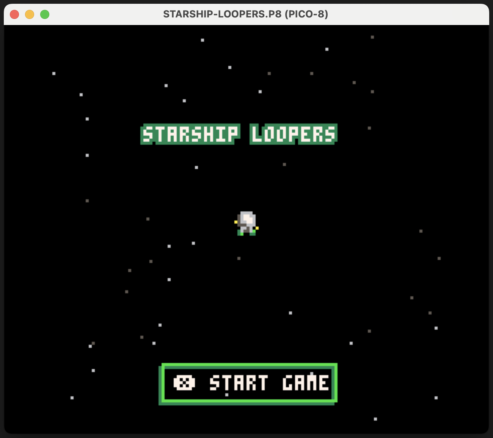
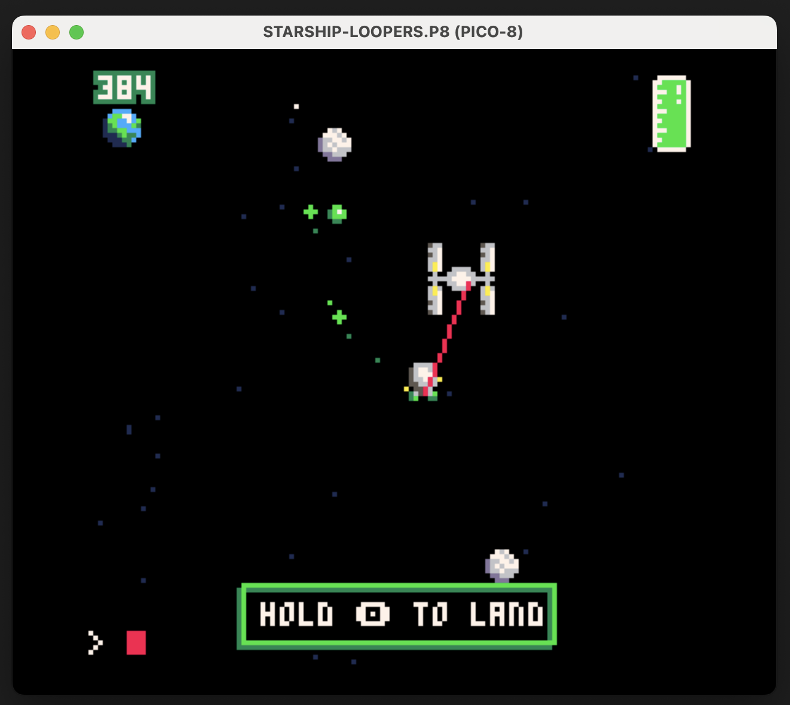
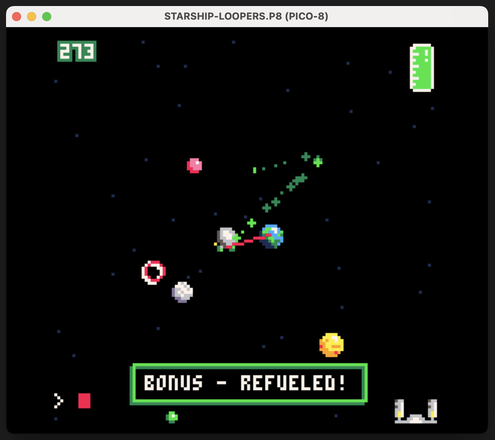

# 🛰️☄️ Starship Loopers

## Description

PICO-8 `starship loopers` is a retro-style game created by [David Allen Feil](https://github.com/wobblybits), [Elise Kim](https://github.com/eayhkim), [Adrien Lynch](https://github.com/aadriien), and [Jennifer Wang](https://github.com/saturzay) for submission to the [GMTK Game Jam 2025](https://itch.io/jam/gmtk-2025)!

We collaboratively built this over the course of just a few days during the Summer 2 batch at [the Recurse Center](https://www.recurse.com) (July / Aug 2025)

## Live Link

Our game can be played directly in browser! 

Check it out here ——> **[https://microscientist.itch.io/starship-loopers](https://microscientist.itch.io/starship-loopers)**

## Example Images

🕹️ Starting Screen   |   🚀 Ship Landing   |   🔋 Bonus Refueled
:-------------------------:|:-------------------------:|:-------------------------:
  |    |  

